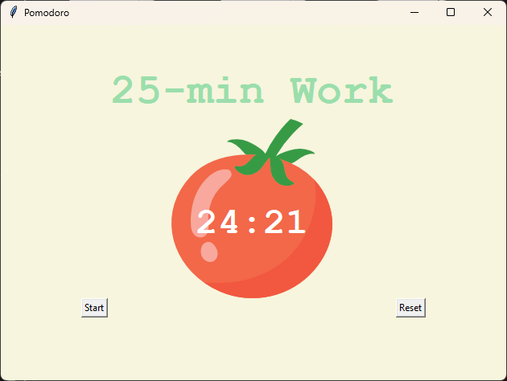
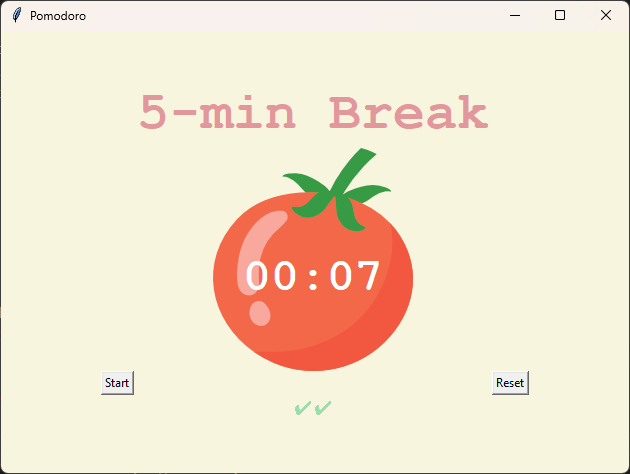

# Pomodoro Timer 🍅

A desktop productivity application built with Python and Tkinter, designed to help you stay focused and manage your time using the **Pomodoro Technique** (25 minutes of work followed by a short break).

## 🚀 Features
- **Dynamic Timer:** Automatically switches between Work sessions (25 min), Short Breaks (5 min), and Long Breaks (20 min).
- **Progress Tracking:** Displays checkmarks (✔) for every completed work session.
- **Visual Feedback:** Color-coded titles and a clean UI for better focus.
- **Reset Functionality:** Quickly reset the timer and progress at any time.

## 🛠️ Built With
- **Python 3**
- **Tkinter** (Standard Python Interface to Tcl/Tk)

## 📸 Screenshots

| Work Mode | Break Mode |
|---|---|
|  |  |

## 📋 How to Run
1. Ensure you have Python installed on your system.
2. Clone this repository:
   ```bash
   git clone [https://github.com/seiffayed/Pomodoro.git](https://github.com/seiffayed/Pomodoro.git)
3. Make sure the tomato.png file is in the same directory as main.py.
4. Run the application:
   ```bash
   python main.py
