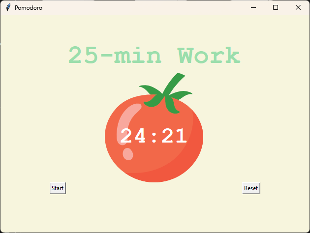
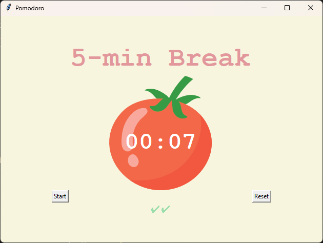

# Pomodoro Timer 🍅


Pomodoro Timer is a beginner-friendly desktop productivity app built with Python and Tkinter. It helps users stay focused by cycling through work sessions, short breaks, and long breaks using the Pomodoro Technique.

## 📸 Screenshots

| Work Session | Break Session |
| --- | --- |
|  |  |

## 🚀 Features

- Run 25-minute focused work sessions.
- Automatically switch to 5-minute short breaks after each work session.
- Automatically switch to a 20-minute long break after every four work sessions.
- Display the active mode with clear labels and colors.
- Show completed work sessions with check marks.
- Reset the timer and progress at any time.
- Use a simple Tkinter interface with Start and Reset controls.

## 🛠️ Tech Stack

- **Python** - core programming language
- **Tkinter** - built-in GUI library

## ⚙️ How It Works

1. Click **Start** to begin a 25-minute work session.
2. When the work session ends, the app automatically starts a 5-minute break.
3. Each completed work session adds a check mark under the timer.
4. After four completed work sessions, the app starts a 20-minute long break.
5. Click **Reset** to stop the current timer, clear the check marks, and return the timer to `00:00`.

## 🔁 Timer Cycle

```text
Work Session 1  -> Short Break
Work Session 2  -> Short Break
Work Session 3  -> Short Break
Work Session 4  -> Long Break
```

## 📦 Installation

### 1. Clone the Repository

```bash
git clone https://github.com/seiffayed/Pomodoro_Timer.git
cd Pomodoro_Timer
```

### 2. Run the App

Tkinter is included with most Python installations, so no extra packages are required.

```bash
python main.py
```

## 📁 Project Structure

```text
Pomodoro_Timer/
|-- main.py
|-- tomato.png
|-- work.png
|-- break.png
|-- README.md
|-- LICENSE
`-- .gitignore
```

## 🎓 Credits

This project is part of the **100 Days of Code: The Complete Python Pro Bootcamp** learning path.

## 📄 License

This project is licensed under the MIT License. See the `LICENSE` file for details.

## 🙌 Author

Built by **SeiF Fayed** as a Python Tkinter project for practicing productivity timers, countdown logic, and GUI development.
